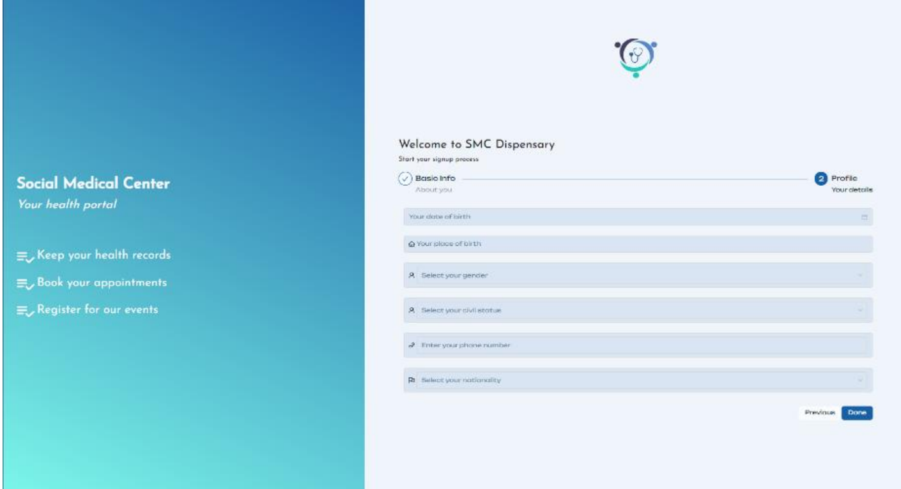
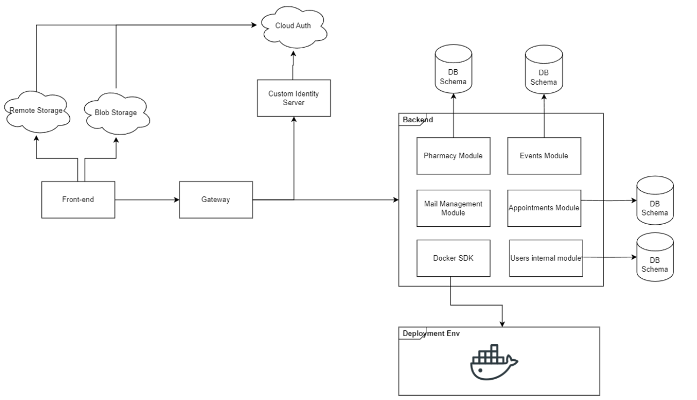

# e-Health Platform for Social Medical Center
---

This project is part of a philanthropic initiative, for the Medical and Social Center [M.J.O. Beirut](https://mjobeyrouth.wordpress.com/). A testament to this rapidly evolving digital age, we aimed to digitize the services offered by the Medical Center, not only to keep pace with modern advancements but also to enhance accessibility, efficiency, and convenience for both patients and medical personel. 
This project packs a list of applications forming the digital infrastrcure of the medical center, along with a user-friendly web portal for patients, doctors and admins. Embodying the the spirit of M.J.O. Beirut, this platform follows best practices for rigid information security and scalability.

The different features are:

- Pharmacy and Meds Sotrage management
- Appointments management with email notification
- Social news builder
- Secure Patients records management

All those features are seamlessly integrated in a Single-Page UI with customized visibility for each user/medical personel.




## General building blocks




The diagram above shows the general structure. There are three main layers:
- The frontend
- The gateway
- The backend

The frontend, responsible for the user interface, seamlessly interacts with cloud services for data storage. Meanwhile, the backend, accessible only through the identity management gateway, handles business logic and data processing. Each backend module operates independently, ensuring robustness and future scalability. Our architecture is made with growth in mind, whether you’re expanding within a monolithic system or transitioning to a full microservices setup.

### Tools and technologies

<table>
    <caption>Table 1</caption>
    <thead>
        <tr>
            <th>Module</th>
            <th>Purpose</th>
            <th>Tool</th>
        </tr>
    </thead>
    <tbody>
        <tr>
            <td rowspan=2>Database</td>
            <td>Storing generated user data</td>
            <td>Postgres</td>
        </tr>
        <tr>
            <td>Storing sensitive user data</td>
            <td>Firestore</td>
        </tr>
        <tr>
            <td>Authentication service</td>
            <td>Authenticating users and admins and supported
extension for role-based access control</td>
            <td>Firebase Auth</td>
        </tr>
        <tr>
            <td>File Storage service</td>
            <td>Stpring static images from users</td>
            <td>Firebase Cloud Storage</td>
        </tr>
        <tr>
            <td>API Gateway</td>
            <td>Reverse proxy to handle requests to multiple backends </td>
            <td>Nginx</td>
        </tr>
        <tr>
            <td>Deployment</td>
            <td>Containerization tool to handle local and future remote deployments </td>
            <td>Docker</td>
        </tr>
        <tr>
            <td>Front-end framework</td>
            <td>Enterprise level, easy to use user interface with rich components</td>
            <td>Angular</td>
        </tr>
        <tr>
            <td rowspan=3>Backend frameworks</td>
            <td>User related business logic</td>
            <td>Java Spring Boot</td>
        </tr>
        <tr>
            <td>Internal tooling logic</td>
            <td>Python with FastAPI</td>
        </tr>
        <tr>
            <td>Firebase admin tooling extension and wrapper</td>
            <td>Python with FastAPI</td>
        </tr>
    </tbody>
</table>

## Deployment
### Pre-requisites
- Docker
- A firebase project including
    - Firebase auth for identity management
    - Firestore for sensitive
    - Firebase storage 

### Firebase project 

All used services are part of the free plan.

Excluded from this repository are the Firebase setup processes.

Setup for auth:
- Password authentication and Google authenticaition.
- Password verfication.
- Password change.

Setup for Firestore:
- Store protection based on auth status and roles 
- Schema initialization

### Final Steps
You will firstly need to change the database connection strings in the proper `application.properties` files. Removal of the SQL container in the docker compose file may be necessary if you are using a standalone Database Server.

The database schemas needed are not automatically created. They should be manually added.

Once satisfied
```sh
docker compose up
```

## Acknowledgement
[Afrah Hassan](https://github.com/afrahhassan0)

[Ahmad Obeid](https://github.com/obeidahmad)

-----

## [Further Reading](https://github.com/obeidahmad/e-Health_Platform/tree/main/Documents)

